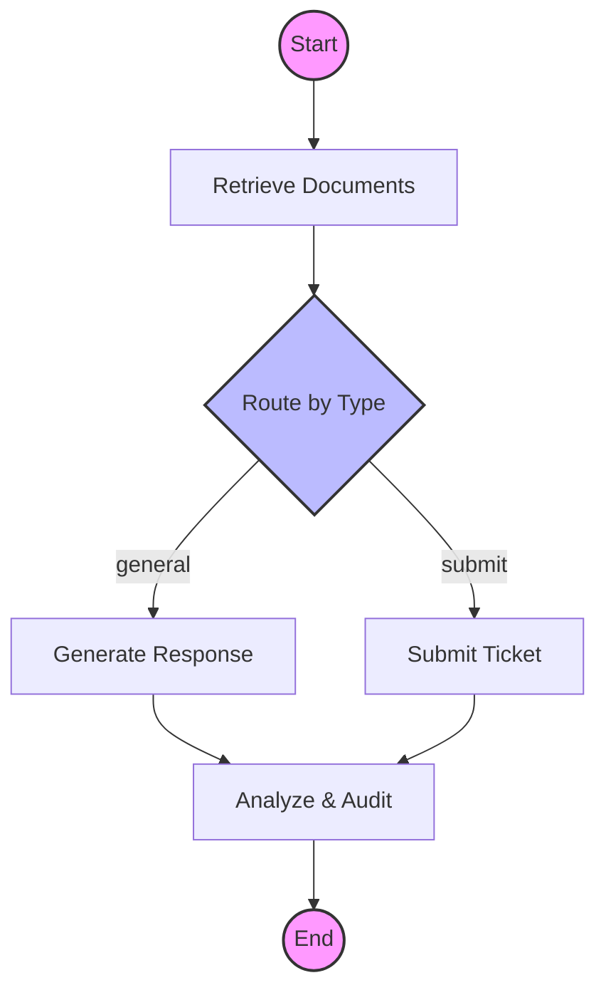

# xcare-bot-agent Modernized

A state-of-the-art healthcare chatbot server built with **LangGraph**, **Ollama**, and **LangChain v0.3**. This project has been modernized to provide a robust, agentic workflow for healthcare assistants, featuring high-quality semantic retrieval (RAG) and evaluation-ready API responses.

## 🚀 Key Modernizations
- **LangGraph Integration**: Stateful, traceable logic graph replacing legacy state management.
- **Ollama Powered**: Native support for `llama3` and `mxbai-embed-large` models.
- **Modular LangChain**: Upgraded to the latest v0.3 modular ecosystem.
- **Semantic RAG**: Higher quality knowledge retrieval compared to legacy keyword-based systems.
- **Testing Standard**: Streamlined API testing with Bun Test and Axios.

## 📊 Agent Workflow


## 🛠️ Prerequisites
- **Bun**: v1.1 or later.
- **Ollama**: Installed and running locally.
- **Models**: Pull required models before starting:
  ```bash
  ollama pull llama3
  ollama pull mxbai-embed-large
  ```

## 📦 Installation
```bash
# Install dependencies
bun install
```

# Start the server
bun start
```
The server will be available at `http://localhost:5002`.

## ✅ Testing
We use a streamlined Bun Test + Axios suite for verifying the API.
```bash
bun test
```

## 🧠 Architecture
- **`src/services/graph/agentGraph.ts`**: The core LangGraph definition (Retrieve -> Generate -> Analyze).
- **`src/services/RAGservice/knowledgeBase.ts`**: Modern RAG implementation with Ollama embeddings and MemoryVectorStore.
- **`src/handlers/ollamaHandlers.ts`**: Express handler that invokes the LangGraph agent.
- **`src/knowledge/`**: JSON files containing the domain knowledge for the chatbot.

## 📊 API Metadata (For Evaluation)
The `/agent/generate` endpoint returns a `debug` field specifically designed for professional automated evaluation:
- `retrievalCount`: Number of documents retrieved for the query.
- `topScore`: The similarity score of the most relevant document.
- `requiresHumanIntervention`: Flag for critical symptoms or complex queries.
- `timestamp`: Precise ISO timestamp for audit trails.

---
*Modernized by Antigravity*
