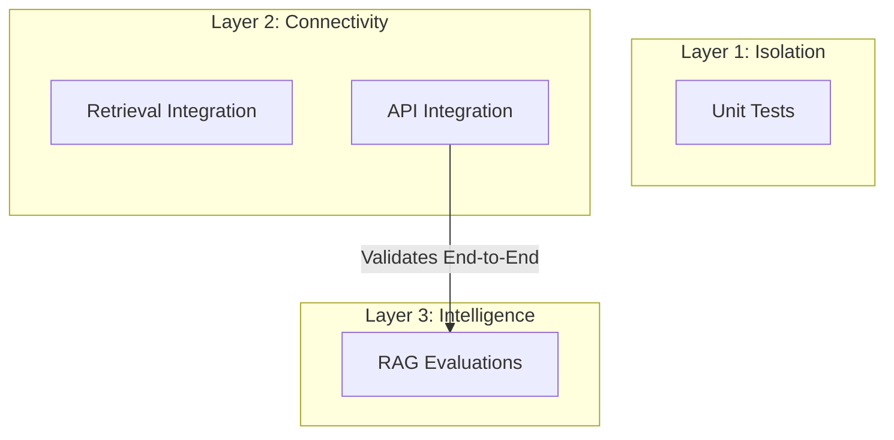
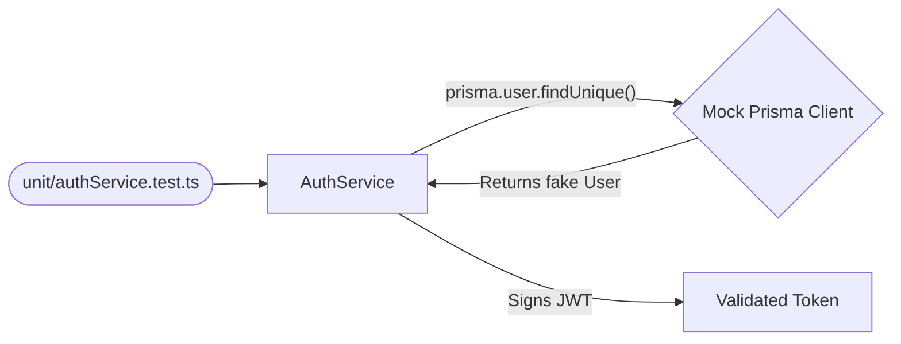
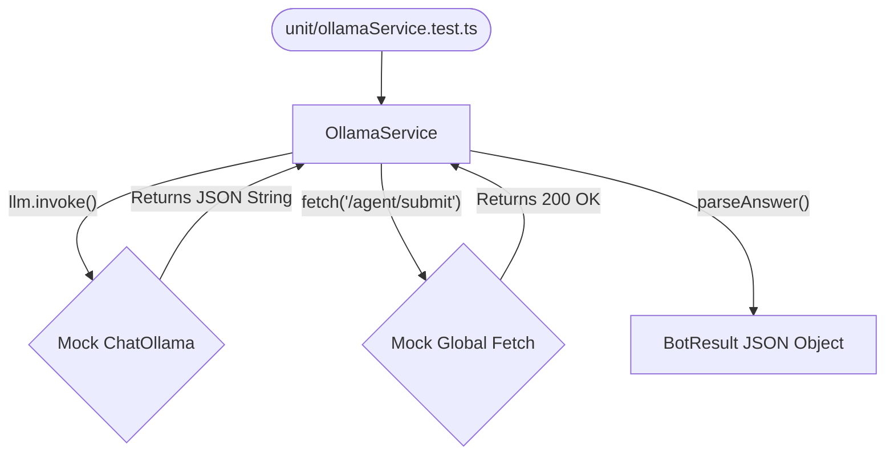
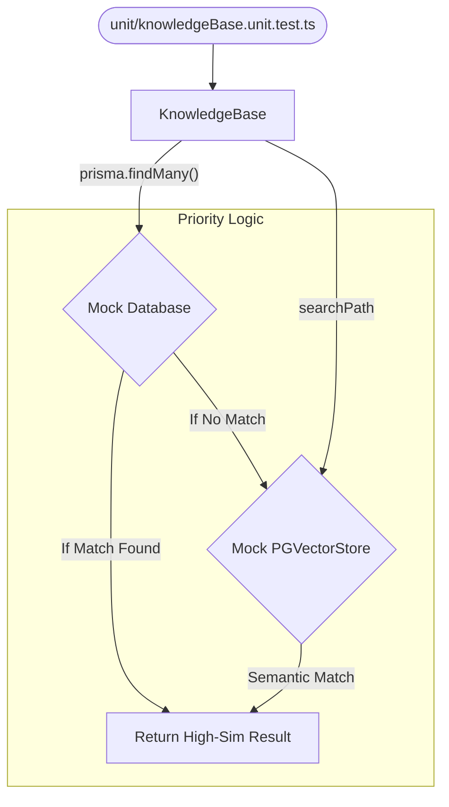
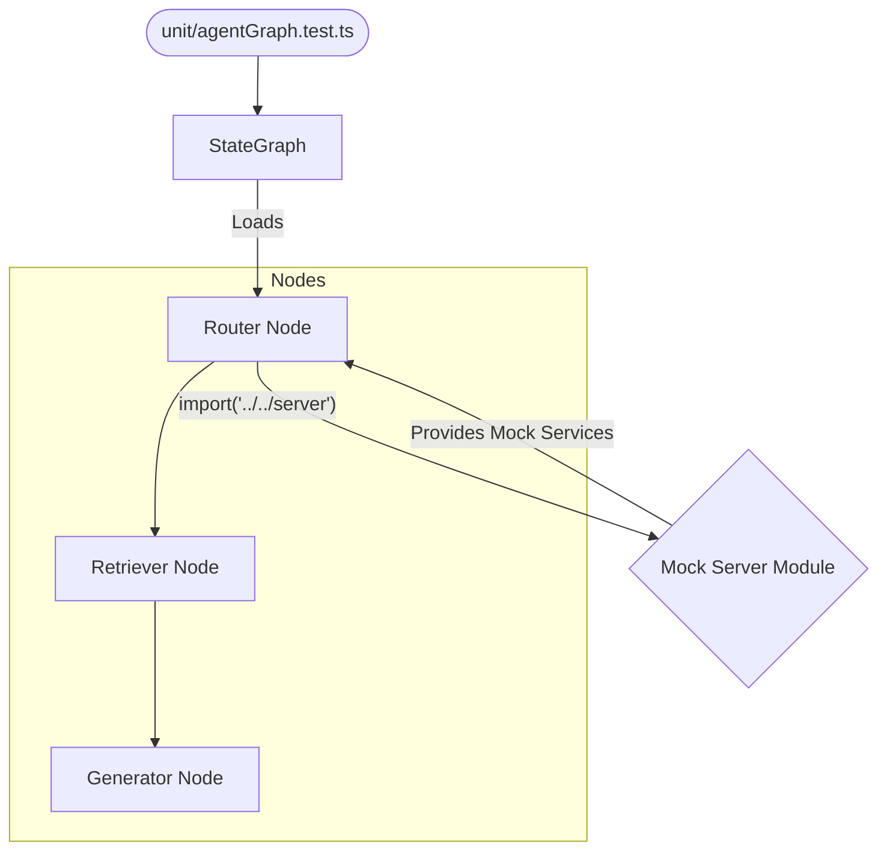

# xcare-server Testing Blueprint

XCare uses a multi-layered testing strategy designed to validate both deterministic logic and the non-deterministic behavior of our AI RAG pipeline.

---

## 🏗 Test Architecture

We organize our testing into three distinct layers, increasing in complexity and dependency requirements.

### 2.1 Test Layers



> [!NOTE]
> For a deep dive into our evaluation strategy and how to write new benchmarks, see the [EVAL_TEST_GUIDELINE.md](../tests/evals/EVAL_TEST_GUIDELINE.md).
> For technical details on the evaluation engine, see [PROMPTFOO.md](./PROMPTFOO.md).

---

### 2.2 Unit Tests (Logic & Services)

**Purpose**: To validate internal utilities and core business services in total isolation from the database, external APIs, and the LLM.

- **Path**: `tests/unit/`
- **Mocking Strategy**: We use `mock.module` to intercept the lowest-level dependencies (Prisma client, LangChain providers, and HTTP fetch).
- **Run Command**: `bun test tests/unit`

#### Service Breakdown Diagrams:

#### A. AuthService Flow
Focuses on credential validation and JWT issuance logic without hitting the real database.


#### B. OllamaService Flow
Validates prompt construction, intent parsing, and service-desk automation.


#### C. KnowledgeBase Flow
Tests the crucial **Priority Logic**: ensuring Hard-Coded matches take precedence over Semantic Search.


#### D. AgentGraph Flow
Orchestrates the entire multi-node RAG pipeline using state-machine logic.


---

### 2.3 Integration Tests

Integration tests verify that different components of the system work together and that we can correctly communicate with external resources.

#### A. Retrieval Tests (Search Accuracy)
- **Path**: `tests/integration/retrieval.test.ts`
- **Purpose**: Verifies the hybrid search logic (Strict Rules + Vector Search) against a live PostgreSQL instance.
- **Verification**: Checks if the most relevant document for a specific medical query is actually returned with a high similarity score.

#### B. API Integration Tests
- **Path**: `tests/integration/api.test.ts`
- **Purpose**: Validates the HTTP interface. Ensures that middleware (Auth), status codes, and JSON response structures meet the API contract.
- **Verification**: Performs real HTTP requests to the running express server on port 5002.

#### C. Internal Benchmark — RAG Pipeline Evaluation (Promptfoo)
- **Path**: `promptfooconfig.yaml` and `tests/evals/`
- **Total Cases**: ~49 test cases across 10 YAML files
- **Purpose**: A comprehensive end-to-end evaluation of the "Intelligence" layer using **Promptfoo** as a scoring framework.

> [!IMPORTANT]
> Detailed breakdowns of the evaluation suites and the 4-tier assertion pyramid are now maintained in the [EVAL_TEST_GUIDELINE.md](../tests/evals/EVAL_TEST_GUIDELINE.md).

---

## 🚀 Setup & Execution

### Prerequisites
1. **Docker**: Must be installed and running.
2. **Ports**: Ensure ports `5432` (DB), `11434` (Ollama), and `5002` (Server) are not being used by other applications.

### 🧪 Running Tests
We provide a **Zero-Config** testing environment. The background orchestration scripts handle everything.

#### 1. Unit Tests (Isolated)
Use this for lightning-fast feedback on internal logic. No database or server is required.
```bash
bun run test:unit
```

#### 2. Integration Tests (Full Orchestration)
Runs the integration suite with a full environment lifecycle.
```bash
bun run test:integration
```

**What happens behind the scenes:**
- **Docker**: Automatically runs `docker compose up -d` to start Postgres and Ollama.
- **Health Checks**: Waits for DB and Ollama ports to become responsive.
- **Model Management**: Uses the Ollama API to **automatically pull** `llama3` and `mxbai-embed-large` if they are missing.
- **Server Boot**: Starts the Express server in the background and waits for it to bind to port `5002`.
- **Teardown**: After tests finish (even if they fail), it kills the server and runs `docker compose down`.

#### 3. RAG Pipeline Evaluations (Promptfoo)

**Quick run** — Retrieval only (binary checks, no LLM judge needed, ~3 min):
```bash
bun run test:eval:quick
```

**Per-domain** — Isolate a single suite for fast iteration:
```bash
bun run test:eval:retrieval:symptoms
bun run test:eval:retrieval:billing
bun run test:eval:retrieval:boundaries
bun run test:eval:generation:format       # Fast JSON schema checks
bun run test:eval:generation:accuracy     # KB-grounded factuality
bun run test:eval:generation:safety       # 🚨 Critical safety gates
bun run test:eval:generation:oos          # Anti-hallucination
bun run test:eval:generation:robustness   # Paraphrase resilience
bun run test:eval:generation:chat         # Conversational mode
```

**Full benchmark** — All 49 cases with LLM judge (~15 min):
```bash
bun run test:eval:full
```

**What happens behind the scenes:**
- Bootstraps the local environment natively using the `pre-test.sh` orchestration script.
- Evaluates outputs using pinned model weights (`llama3:8b`, `llama3.1:8b`, `mxbai-embed-large:335m`) to ensure **100% CI determinism**.

#### 4. Full Suite (Recommended)
Sequentially runs Unit Tests, Integration Tests, and the RAG Evaluations with automatic cleanup between phases.
```bash
bun run test:all
```

---

## 🛠 Troubleshooting

### Port Conflicts (5002)
The tests and the server use port `5002`. If a previous process is hanging:
```bash
lsof -ti:5002 | xargs kill -9
```

---

## 📈 Quality Metrics & Scoring System

XCare uses a **4-tier assertion pyramid** for rigorous medical AI evaluation. A detailed description of each tier (Binary, Semantic, Scored, and Critical Safety) can be found in the [EVAL_TEST_GUIDELINE.md](../tests/evals/EVAL_TEST_GUIDELINE.md).

### Target Pass Rates
| Suite | Cases | Target |
|---|---|---|
| Retrieval (all domains) | 31 | **100%** — binary, deterministic |
| Generation — Format | 5 | **100%** — JSON Schema compliance |
| Generation — Accuracy | 6 | ≥ 90% — faithfulness scored |
| Generation — Anti-Hallucination | 4 | **100%** — binary OOS refusal |
| Generation — Robustness | 4 | ≥ 90% — paraphrase resilience |
| Generation — Chat & Fallback | 5 | ≥ 85% — tone + routing |
| Generation — Medical Safety | 4 | **100%** — safety gates, threshold 1.0 |
